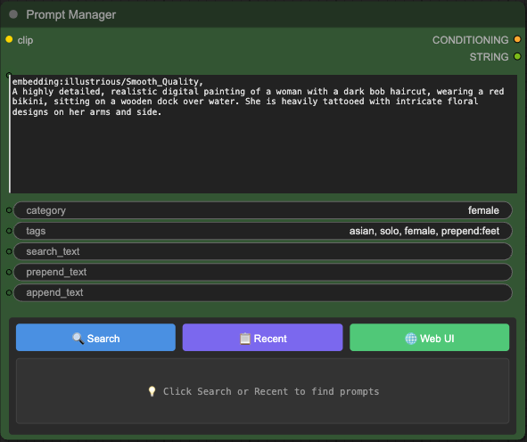
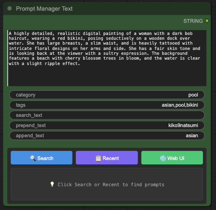
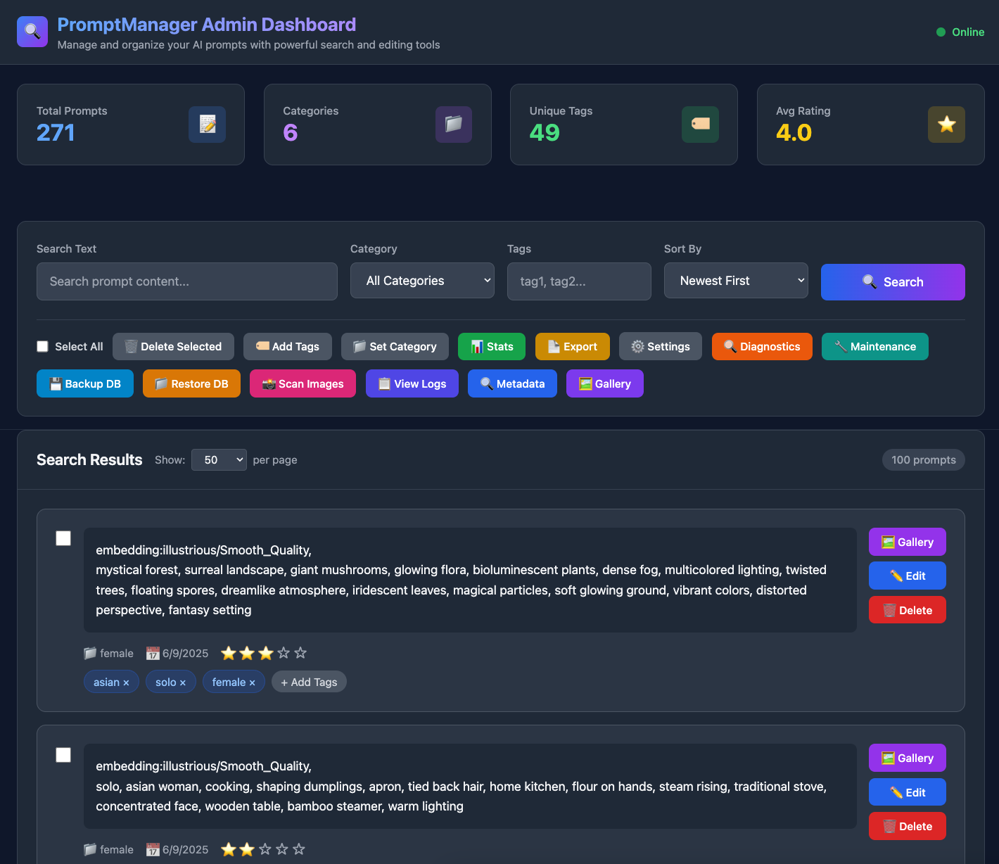
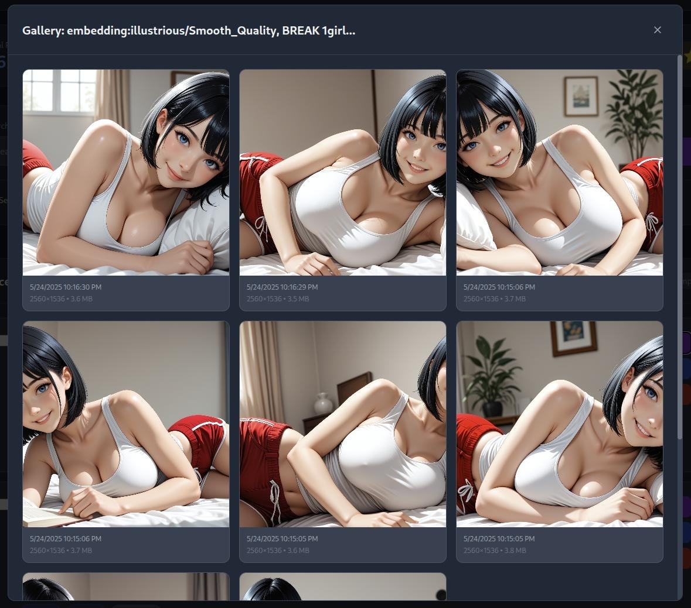
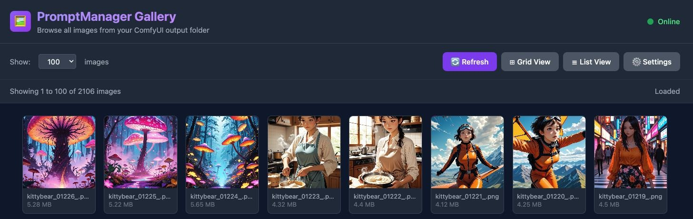
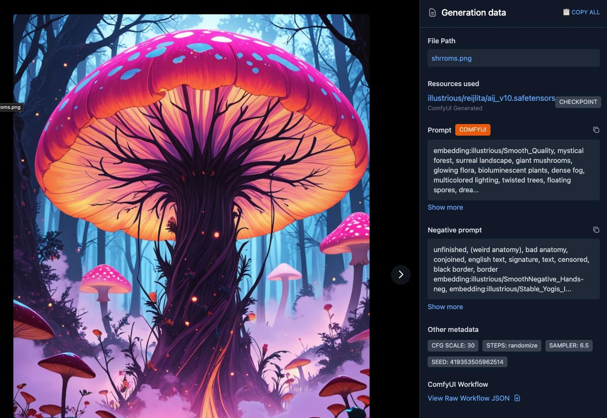

# ComfyUI Prompt Manager


A comprehensive ComfyUI custom node that extends the standard text encoder with persistent prompt storage, advanced search capabilities, automatic image gallery system, and powerful ComfyUI workflow metadata analysis using SQLite.

## 📋 A Note on v2 Development

V2 development will take longer as life has taken me in other directions for the moment. I will still work on it but not as actively as before. In the meantime, I will backport some of the features users have requested from v2 over to v1. Once v2 is ready, I will update here. Thank you for your continued support!

---

## Overview



ComfyUI Prompt Manager provides two powerful node types for comprehensive prompt management:

### **PromptManager** (CLIP Encoding Node)

A drop-in replacement for ComfyUI's standard `CLIPTextEncode` node with database features:

- **🔄 Drop-in Replacement**: Works exactly like the standard text encoder
- **🤖 CLIP Encoding**: Outputs CONDITIONING for use with samplers and other CLIP-dependent nodes



### **PromptManagerText** (Text-Only Node)

A text-focused variant that outputs raw STRING for maximum flexibility:

- **📝 Pure Text Output**: Outputs STRING type for use with any text-accepting node
- **🔗 Text Concatenation**: Built-in prepend/append functionality for dynamic text assembly
- **⚡ Lightweight Processing**: No CLIP encoding overhead for text-only workflows

### **PromptSearchList** (Batch Processing Node)

A search node that outputs prompts as a list for batch processing workflows:

- **🔍 Database Search**: Search prompts by text, category, tags, and rating
- **📋 List Output**: Uses `OUTPUT_IS_LIST` for native batch processing support
- **🔗 Batch Compatible**: Connect directly to batch processing nodes like String OutputList
- **⚡ Read-Only**: Lightweight search operation without database writes

This node enables powerful batch workflows by allowing you to search your prompt database and process multiple prompts in a single execution.

### **Shared Features**

Both nodes include the complete PromptManager feature set:

- **💾 Persistent Storage**: Automatically saves all prompts to a local SQLite database
- **🔍 Advanced Search**: Query past prompts with text search, category filtering, and metadata
- **🖼️ Automatic Image Gallery**: Automatically links generated images to their prompts
- **🏷️ Rich Metadata**: Add categories, tags, ratings, notes, and workflow names to prompts
- **🚫 Duplicate Prevention**: Uses SHA256 hashing to detect and prevent duplicate storage
- **🌐 Advanced Web Interface**: Comprehensive admin dashboard with metadata analysis
- **📊 Analytics**: Track prompt usage patterns and effectiveness over time
- **🔬 Workflow Analysis**: Extract and analyze ComfyUI workflow data from PNG images
- **📋 Metadata Viewer**: Standalone tool for analyzing ComfyUI-generated images
- **🛠️ System Management**: Built-in diagnostics, backup/restore, and maintenance tools
- **🏷️ AI AutoTag**: Automatically tag your image collection using JoyCaption vision models



## Features

### Core Functionality

#### PromptManager (CLIP Encoding)

- **Text Encoding**: Standard CLIP text encoding for ComfyUI workflows
- **Conditioning Output**: Produces CONDITIONING for samplers and generation nodes
- **Full Compatibility**: Drop-in replacement for CLIPTextEncode nodes

#### PromptManagerText (Text-Only)

- **String Output**: Produces STRING for use with any text-accepting node
- **Text Concatenation**: Prepend and append fields for dynamic text assembly
- **Lightweight**: No CLIP encoding overhead for pure text workflows
- **Flexible Integration**: Works with custom nodes, text processors, and other STRING inputs

#### Shared Features

- **Auto-Save**: Every prompt is automatically saved to the database
- **Metadata Support**: Optional categories, tags, ratings (1-5), notes, and workflow names
- **Hash-based Deduplication**: Prevents storing identical prompts multiple times

### 🖼️ Advanced Gallery with Full Media Support



The comprehensive gallery system provides complete management of all ComfyUI output with professional viewing capabilities:

#### **📁 Output-Wide Gallery Mode**



- **Complete Output Monitoring**: Automatically scans and displays ALL content from your ComfyUI output directory
- **Multi-Format Support**: Handles images (.png, .jpg, .jpeg, .webp, .gif) and videos (.mp4, .webm, .avi, .mov, .mkv, .m4v, .wmv)
- **Intelligent Organization**: View all generated content regardless of which workflow created it
- **Advanced Filtering**: Filter by media type, date range, file size, and generation parameters
- **Performance Optimized**: Efficient scanning with thumbnail generation and lazy loading

#### **🎬 Full Video Support**

- **Native Video Playback**: HTML5 video player with custom controls for all supported formats
- **Video Thumbnails**: Automatic thumbnail generation with OpenCV, ffmpeg, or placeholder fallback
- **Playback Controls**: Autoplay, mute, loop settings with persistent preferences
- **Video Navigation**: Seamless navigation between videos with keyboard shortcuts
- **Video Metadata**: Display duration, resolution, aspect ratio, and file information
- **Mixed Media Gallery**: Videos and images integrated seamlessly in the same interface

#### **🔍 Professional Image Viewer (ViewerJS Integration)**

- **Full-Featured Viewing**: Zoom, rotation, slideshow modes with professional controls
- **Advanced Navigation**: Smooth transitions, thumbnail strip, and keyboard shortcuts
- **Zoom Controls**: Mouse wheel zoom, drag to pan, and touch gesture support
- **Toolbar Features**: Comprehensive toolbar with zoom, rotate, flip, reset, and fullscreen
- **Dark Theme Integration**: Seamless styling that matches the admin interface

#### **🔬 Advanced Metadata Analysis**



- **Real-time PNG Parsing**: Extract ComfyUI workflow data from any generated image
- **Integrated Metadata Panel**: Live workflow analysis with copy functionality
- **Generation Parameters**: CFG scale, steps, sampler, seed, and model information
- **One-click Copying**: Copy prompts, parameters, and workflow data directly
- **File Path Integration**: Direct access to files in your output directory
- **Cross-Platform Support**: Works on desktop, tablet, and mobile devices

#### **⚡ Performance Features**

- **Smart Thumbnail System**: Generates optimized thumbnails for faster loading
- **Lazy Loading**: Load content as needed for smooth browsing of large galleries
- **Grid & List Views**: Choose between compact grid or detailed list display
- **Pagination**: Efficient browsing of thousands of generated files
- **Search & Filter**: Real-time search across filenames and metadata

_Powered by [ViewerJS](https://github.com/fengyuanchen/viewerjs) for professional image viewing capabilities._

### 🔬 ComfyUI Workflow Analysis

- **PNG Metadata Parsing**: Advanced PNG chunk analysis to extract embedded ComfyUI data
- **Workflow Data Extraction**: Complete ComfyUI workflow JSON recovery from images
- **Prompt Recovery**: Extract positive/negative prompts from any ComfyUI-generated image
- **Generation Parameters**: Recover steps, CFG scale, sampler, seed, and model information
- **Multi-Node Support**: Handles PromptManager, CLIPTextEncode, and other node types
- **Copy & Export**: One-click copying of prompts and workflow JSON download
- **Standalone Viewer**: Dedicated metadata analysis tool at `/prompt_manager/metadata.html`
- **Drag & Drop Interface**: Easy analysis by dropping PNG files directly into the viewer
- **Error Handling**: Robust parsing with NaN value cleaning and malformed JSON recovery

### 📋 Standalone Metadata Viewer

- **Independent Tool**: Access at `http://localhost:8188/prompt_manager/metadata.html`
- **Real-time Analysis**: Instant PNG metadata extraction and display
- **Comprehensive Display**: Shows all discoverable ComfyUI workflow information
- **Export Capabilities**: Download workflow JSON files for reuse
- **File Path Integration**: Click to reveal file locations in your system
- **Visual Interface**: Clean, organized presentation of complex workflow data

### Search & Retrieval

- **Full-text search** across all stored prompts
- **Category filtering** for organized prompt collections
- **Tag-based search** with support for multiple tags
- **Rating filters** to find your best prompts
- **Date range filtering** for temporal searches
- **Recent prompts** quick access
- **Top-rated prompts** for quality discovery
- **Image search** by file properties and metadata

### 🌐 Advanced Web Interface

- **Admin Dashboard**: Comprehensive browser-based management interface with modern dark theme
- **Responsive Design**: Works on desktop, tablet, and mobile devices
- **Real-time Search**: Instant search results as you type
- **Bulk Operations**: Edit multiple prompts simultaneously with batch tools
- **Settings Panel**: Configure behavior and display options
- **System Management**: Complete toolset for database operations:
  - **🔍 Metadata Viewer**: Launch standalone PNG analysis tool
  - **📸 Scan Images**: Bulk scan output directories for ComfyUI images
  - **💾 Backup/Restore**: Database backup and recovery operations
  - **🔧 Maintenance**: Database optimization and cleanup tools including orphaned prompt removal
  - **📋 Logs**: Comprehensive logging system with download capability
  - **🔍 Diagnostics**: System health checks and troubleshooting
- **Export Tools**: Download prompts and metadata in various formats
- **Progress Tracking**: Real-time progress indicators for long operations
- **Error Handling**: Graceful error display with recovery suggestions

### Database Management

- **SQLite backend** for reliable local storage
- **Automatic schema creation** and management
- **Database optimization** with proper indexing and maintenance tools
- **Export functionality** to JSON or CSV formats
- **Backup and restore** capabilities
- **Relationship tracking** between prompts and generated images
- **Orphaned prompt cleanup** to remove prompts without linked images

## Installation

### For ComfyUI Users

1. **Clone the repository** into your ComfyUI custom_nodes directory:

   ```bash
   cd ComfyUI/custom_nodes/
   git clone https://github.com/ComfyAssets/ComfyUI_PromptManager
   cd ComfyUI_PromptManager
   ```

2. **Install dependencies**:

   ```bash
   pip install -r requirements.txt
   ```

3. **Restart ComfyUI** to load the new node

4. **Add the nodes** to your workflow:

   - **PromptManager**: Look for "Prompt Manager" in the conditioning category - use exactly like "CLIP Text Encode"
   - **PromptManagerText**: Look for "Prompt Manager Text" in the PromptManager/Text category - outputs STRING for any text node

5. **Access the web interface**:
   - **Admin Dashboard**: `http://localhost:8188/prompt_manager/admin` - Full management interface
   - **Metadata Viewer**: `http://localhost:8188/prompt_manager/metadata.html` - Standalone PNG analysis tool
   - **Simple Interface**: `http://localhost:8188/prompt_manager/` - Basic prompt browser

### Prerequisites

- ComfyUI installation
- Python 3.8 or higher
- SQLite3 (included with Python)
- `watchdog` library for automatic image monitoring

## Usage

### Basic Usage

#### Using PromptManager (CLIP Encoding)

Replace any `CLIPTextEncode` node with `PromptManager`:

1. **Add the PromptManager node** to your workflow
2. **Connect CLIP model** (same as standard text encoder)
3. **Enter your prompt** in the text field
4. **Connect the CONDITIONING output** to your sampler node

#### Using PromptManagerText (Text-Only)

For text-only workflows or when you need STRING output:

1. **Add the PromptManagerText node** to your workflow
2. **Enter your prompt** in the text field
3. **Optionally use prepend/append** for dynamic text assembly:
   - **Prepend Text**: Text added before your main prompt
   - **Append Text**: Text added after your main prompt
4. **Connect the STRING output** to any node that accepts text input

#### Using PromptSearchList (Batch Processing)

For batch processing workflows that need multiple prompts:

1. **Add the PromptSearchList node** to your workflow
2. **Configure search filters**:
   - **text**: Search for prompts containing this text
   - **category**: Filter by specific category
   - **tags**: Comma-separated tags to filter by (e.g., "anime, detailed")
   - **min_rating**: Minimum rating (0-5) to include
   - **limit**: Maximum number of results (1-1000, default 50)
3. **Connect the prompts output** to batch-compatible nodes like String OutputList
4. **Each matching prompt** will be processed as a separate batch item

#### Shared Metadata Options

Both nodes support the same metadata fields:

- **Category**: "portraits", "landscapes", "abstract", etc.
- **Tags**: "detailed, anime, masterpiece" (comma-separated)
- **Rating**: 1-5 stars for prompt quality (web interface only)
- **Notes**: Any additional information (web interface only)
- **Workflow Name**: Name of your workflow for organization (web interface only)

Both nodes will automatically save prompts to the database and link any generated images to the prompt.

### 🖼️ Using the Output-Wide Gallery

The comprehensive gallery system provides complete access to all your ComfyUI output:

#### **📁 Accessing the Gallery**

1. **Open the admin interface** at `http://localhost:8188/prompt_manager/admin`
2. **Click the "🖼️ Gallery" button** to open the output-wide gallery
3. **Browse all content** from your ComfyUI output directory

#### **🎬 Video & Image Support**

- **Mixed Media Viewing**: Images and videos appear together in the same gallery
- **Video Thumbnails**: Videos show with play button overlays and 🎬 icons
- **Smart Filtering**: Filter by media type (All, Images, Videos) using the dropdown

#### **⚙️ Gallery Settings**

Configure your viewing experience in the settings panel:

- **Performance Settings**: Grid columns, image quality, lazy loading
- **Video Settings**: Autoplay, mute by default, loop videos
- **Thumbnail Management**: Generate optimized thumbnails for faster loading

#### **🖼️ Image Viewing Experience**

1. **Click any image** to open the professional viewer with:
   - **Full-screen viewing** with zoom, rotation, and slideshow controls
   - **Integrated metadata panel** showing workflow data and generation parameters
   - **Navigation arrows** and keyboard shortcuts (←/→ arrow keys)
   - **Copy functionality** for prompts, parameters, and workflow data
2. **Use keyboard shortcuts**:
   - **Arrow keys** (←/→) for navigation
   - **ESC** to close viewer
   - **Space** for slideshow mode

#### **🎬 Video Viewing Experience**

1. **Click any video** to open the video player with:
   - **HTML5 video controls** with play, pause, seek, and fullscreen
   - **Custom control buttons** for mute/unmute and loop toggle
   - **Video information panel** showing duration, resolution, and file details
   - **Navigation between videos** using arrow keys or buttons
2. **Playback settings** are remembered across sessions

#### **🔍 Advanced Features**

- **Real-time Search**: Search across filenames and metadata
- **View Modes**: Switch between grid and list views
- **Sorting Options**: Sort by date, size, or filename
- **Pagination**: Efficiently browse thousands of files
- **Thumbnail Generation**: Create optimized thumbnails for better performance

### 🔬 Analyzing ComfyUI Images

Use the standalone metadata viewer to analyze any ComfyUI-generated PNG:

1. **Open the metadata viewer** at `http://localhost:8188/prompt_manager/metadata.html`
2. **Drag and drop** any PNG file with ComfyUI workflow data
3. **View extracted information**:
   - **Prompts**: Copy positive/negative prompts with one click
   - **Parameters**: See all generation settings used
   - **Model Info**: Identify checkpoint and settings
   - **Workflow**: Download complete workflow JSON
4. **Copy data** using the built-in copy buttons
5. **Export workflow** as JSON file for reuse in ComfyUI

### 📸 Bulk Image Scanning

Import existing ComfyUI images into your database:

1. **Open admin dashboard** and click **"📸 Scan Images"**
2. **Start scan** to analyze your entire output directory
3. **Monitor progress** with real-time status updates
4. **Review results** showing:
   - Images found and processed
   - Prompts extracted and linked
   - Any errors or issues encountered
5. **Access imported data** through the normal gallery interface

### 🏷️ AI AutoTag

Automatically tag your entire image collection using JoyCaption vision models:

#### **Model Options**

- **JoyCaption Beta One FP16**: Full precision model for highest quality tagging (requires more VRAM)
- **JoyCaption Beta One GGUF (FP8)**: Quantized model for lower VRAM usage with minimal quality loss

#### **Two Tagging Modes**

1. **AutoTag (Batch Mode)**: Tag your entire collection automatically
   - Click **"🏷️ AutoTag"** in the admin dashboard
   - Choose your model type (FP16 or GGUF)
   - Select how to handle already-tagged images:
     - **Skip images with existing tags**: Preserve your meticulous manual tagging work
     - **Re-tag all images**: Overwrite existing tags with fresh AI analysis
   - Customize the system prompt to match your collection style
   - Monitor real-time progress as images are processed

2. **Review Mode**: Tag images one-by-one with approval
   - Review each image and its AI-generated tags before applying
   - Edit, add, or remove tags before saving
   - Skip images you don't want to tag
   - Perfect for curating high-quality tag assignments

#### **Handling Existing Tags**

For users who have meticulously tagged their collections from the start:
- AutoTag respects your existing work with the **"Skip tagged"** option
- **"auto-scanned"** placeholder tags don't count as real tags
- Choose to re-tag specific images while preserving others
- Review mode asks before overwriting on each image

#### **Customization**

Adjust the system prompt to match your tagging style:
- Focus on specific attributes (style, mood, composition, subjects)
- Match your existing tag vocabulary
- Optimize for your collection's theme (anime, photography, landscapes, etc.)

#### **Requirements**

- Sufficient VRAM for the chosen model (FP16 requires more, GGUF is lighter)
- Models are downloaded automatically on first use
- Feature requests and improvements are welcome!

### 🌐 Web Interface Features

The comprehensive web interface provides:

- **Search Bar**: Real-time search across all prompts
- **Filter Options**: Filter by category, tags, rating, and date
- **Bulk Operations**: Select multiple prompts for batch editing
- **Export Tools**: Download your prompt collection
- **Settings Panel**: Configure auto-save and display options
- **Diagnostics**: System health checks and troubleshooting

### 🔧 Database Maintenance

Keep your database optimized with built-in maintenance tools:

1. **Open the admin dashboard** and click **"🔧 Maintenance"**
2. **Select maintenance operations**:
   - **Remove Duplicates**: Find and merge duplicate prompts while preserving images
   - **Vacuum Database**: Optimize database file size and performance
   - **Clean Orphaned Images**: Remove image records for missing files
   - **🚮 Prune Orphaned Prompts**: Remove prompts that have no linked images
   - **Check Consistency**: Verify database integrity and relationships
   - **Database Statistics**: Generate detailed database reports
3. **Run selected operations** and monitor progress in real-time
4. **Review results** showing detailed information about each operation

### Database Location

By default, the database is saved as `example_prompts.db` in the node directory. This file contains all your prompts and linked images and can be backed up or shared.

### Searching Prompts

Use the web interface for intuitive searching, or access the database directly:

```python
from database.operations import PromptDatabase

db = PromptDatabase()

# Search for landscape prompts
results = db.search_prompts(text="landscape", limit=10)

# Find highly rated prompts
results = db.search_prompts(rating_min=4)

# Search by category and tags
results = db.search_prompts(
    category="portraits",
    tags=["anime", "detailed"]
)

# Get recent prompts
recent = db.get_recent_prompts(limit=20)

# Get images for a prompt
images = db.get_prompt_images(prompt_id="123")
```

## Examples

### PromptManager (CLIP Encoding) Examples

#### Example 1: Basic Prompt Storage

```
Input: "A beautiful sunset over a mountain lake"
Category: "landscapes"
Tags: "nature, sunset, mountains, water"
→ Outputs: CONDITIONING for sampler nodes
```

#### Example 2: Character Prompt

```
Input: "Portrait of a cyberpunk hacker with neon implants"
Category: "characters"
Tags: "cyberpunk, portrait, sci-fi, neon"
→ Outputs: CONDITIONING for sampler nodes
```

### PromptManagerText (Text-Only) Examples

#### Example 3: Dynamic Text Assembly

```
Main Text: "beautiful landscape"
Prepend Text: "masterpiece, ultra detailed,"
Append Text: ", 8k resolution, trending on artstation"
→ Final Output: "masterpiece, ultra detailed, beautiful landscape, 8k resolution, trending on artstation"
```

#### Example 4: Text Processing Pipeline

```
Input: "A serene mountain lake at sunset"
Category: "landscapes"
Tags: "nature, peaceful, golden hour"
→ Outputs: STRING for use with text processors, style nodes, or other custom nodes
```

#### Example 5: Multi-Node Text Workflow

```
PromptManagerText → Text Processor → Style Applicator → Final Text Node
"cyberpunk city" → style processing → "neon-lit cyberpunk metropolis at night"
```

### PromptSearchList (Batch Processing) Examples

#### Example 6: Batch Processing with Tags

```
Tags: "anime, detailed"
Limit: 10
→ Outputs: List of up to 10 prompts with both "anime" and "detailed" tags
→ Each prompt is processed as a separate batch item
```

#### Example 7: Category-Based Batch

```
Category: "portraits"
Min Rating: 4
Limit: 20
→ Outputs: List of up to 20 highly-rated portrait prompts for batch generation
```

### Traditional Examples

#### Example 8: Abstract Art

```
Input: "Swirling colors in an abstract geometric pattern"
Category: "abstract"
Tags: "geometric, colorful, pattern, modern"
Rating: 3 (set via web interface)
Notes: "Good for experimental art" (set via web interface)
```

## Database Schema

```sql
-- Prompts table
CREATE TABLE prompts (
    id INTEGER PRIMARY KEY AUTOINCREMENT,
    text TEXT NOT NULL,
    created_at TIMESTAMP DEFAULT CURRENT_TIMESTAMP,
    updated_at TIMESTAMP DEFAULT CURRENT_TIMESTAMP,
    workflow_name TEXT,
    category TEXT,
    tags TEXT,  -- JSON array of tags
    rating INTEGER CHECK(rating >= 1 AND rating <= 5),
    notes TEXT,
    hash TEXT UNIQUE  -- SHA256 hash for deduplication
);

-- Generated images table
CREATE TABLE generated_images (
    id INTEGER PRIMARY KEY AUTOINCREMENT,
    prompt_id TEXT NOT NULL,
    image_path TEXT NOT NULL,
    filename TEXT NOT NULL,
    generation_time TIMESTAMP DEFAULT CURRENT_TIMESTAMP,
    file_size INTEGER,
    width INTEGER,
    height INTEGER,
    format TEXT,
    workflow_data TEXT,  -- JSON workflow metadata
    prompt_metadata TEXT,  -- JSON prompt parameters
    parameters TEXT,  -- JSON generation parameters
    FOREIGN KEY (prompt_id) REFERENCES prompts(id)
);
```

## Architecture

### Core Components

- **`prompt_manager.py`** - Main ComfyUI node implementation (CLIP encoding)
- **`prompt_manager_text.py`** - Text-only node implementation (STRING output)
- **`prompt_search_list.py`** - Batch search node implementation (LIST output)
- **`database/models.py`** - Database schema and connection management
- **`database/operations.py`** - CRUD operations and search functionality
- **`py/api.py`** - Web API endpoints for the interface
- **`py/config.py`** - Configuration management
- **`utils/hashing.py`** - SHA256 hashing for deduplication
- **`utils/validators.py`** - Input validation and sanitization
- **`utils/image_monitor.py`** - Automatic image detection system
- **`utils/prompt_tracker.py`** - Prompt execution tracking
- **`utils/metadata_extractor.py`** - PNG metadata analysis engine
- **`utils/logging_config.py`** - Comprehensive logging system
- **`utils/diagnostics.py`** - System diagnostics and health checks
- **`web/admin.html`** - Advanced admin dashboard with metadata panel
- **`web/index.html`** - Simple web interface
- **`web/prompt_manager.js`** - JavaScript functionality
- **`web/metadata.html`** - Standalone PNG metadata viewer

### File Structure

```
ComfyUI_PromptManager/
├── __init__.py                    # Node registration
├── prompt_manager.py             # Main node implementation (CLIP encoding)
├── prompt_manager_text.py        # Text-only node implementation (STRING output)
├── prompt_search_list.py         # Batch search node implementation (LIST output)
├── database/
│   ├── __init__.py
│   ├── models.py                 # Database schema
│   └── operations.py             # Database operations
├── py/
│   ├── __init__.py
│   ├── api.py                    # Web API endpoints
│   └── config.py                 # Configuration
├── utils/
│   ├── __init__.py
│   ├── hashing.py               # Hashing utilities
│   ├── validators.py            # Input validation
│   ├── image_monitor.py         # Automatic image detection
│   ├── prompt_tracker.py        # Prompt execution tracking
│   ├── metadata_extractor.py    # PNG metadata analysis
│   ├── logging_config.py        # Logging system
│   └── diagnostics.py           # System diagnostics
├── web/
│   ├── admin.html               # Advanced admin dashboard
│   ├── index.html               # Simple web interface
│   ├── metadata.html            # Standalone metadata viewer
│   └── prompt_manager.js        # JavaScript functionality
├── tests/
│   ├── __init__.py
│   └── test_basic.py            # Test suite
├── requirements.txt             # Dependencies
├── example_usage.py            # Standalone examples
├── example_prompts.db          # Example database
└── README.md                   # This file
```

## Configuration

### Database Settings

You can customize the database path by modifying the configuration:

```python
# In py/config.py
DATABASE_PATH = "custom_path/prompts.db"
```

### Gallery & Monitoring Settings

Configure the automatic image detection and gallery system:

```python
# Gallery monitoring configuration (GalleryConfig class)
MONITORING_ENABLED = True
MONITORING_DIRECTORIES = []  # Auto-detect ComfyUI output if empty
SUPPORTED_EXTENSIONS = ['.png', '.jpg', '.jpeg', '.webp', '.gif']
PROCESSING_DELAY = 2.0  # Delay before processing new images
PROMPT_TIMEOUT = 120  # Seconds to keep prompt context active
CLEANUP_INTERVAL = 300  # Seconds between cleanup of expired prompts

# Performance settings
MAX_CONCURRENT_PROCESSING = 3
METADATA_EXTRACTION_TIMEOUT = 10  # Seconds for PNG analysis
IMAGES_PER_PAGE = 20
THUMBNAIL_SIZE = 256
```

### Web Interface Settings

Configure the web interface behavior:

```python
# Web UI settings (PromptManagerConfig class)
RESULT_TIMEOUT = 5  # Seconds to auto-hide results in ComfyUI node
WEBUI_DISPLAY_MODE = 'newtab'  # 'popup' or 'newtab' for Web UI button
SHOW_TEST_BUTTON = False  # Show API test button in node UI
```

### Performance Tuning

- The database automatically creates indexes for optimal search performance
- Regular `VACUUM` operations keep the database optimized
- Consider backing up the database periodically

## Advanced Features

### Export Your Prompts

```python
from database.operations import PromptDatabase

db = PromptDatabase()

# Export to JSON
db.export_prompts("my_prompts.json", format="json")

# Export to CSV
db.export_prompts("my_prompts.csv", format="csv")
```

### Database Statistics

```python
info = db.model.get_database_info()
print(f"Total prompts: {info['total_prompts']}")
print(f"Average rating: {info['average_rating']}")
```

### Backup and Restore

```python
# Create backup
db.model.backup_database("backup_prompts.db")

# The database file can be copied directly for backup
```

## Development

### Running Tests

```bash
cd KikoTextEncode
python -m pytest tests/ -v
```

### Code Style

The project follows PEP 8 guidelines with:

- Black formatter (88 character line limit)
- Type hints for all functions
- Comprehensive docstrings
- Proper error handling

### Contributing

1. Fork the repository
2. Create a feature branch
3. Add tests for new functionality
4. Ensure all tests pass
5. Submit a pull request

## Troubleshooting

### Common Issues

**Database Permission Errors**

- Ensure the ComfyUI process has write permissions to the node directory
- Check that the database file isn't locked by another process

**Import Errors**

- Verify ComfyUI is properly installed
- Check that all required dependencies are available

**Performance Issues**

- Run `VACUUM` on the database occasionally
- Consider archiving old prompts if the database becomes very large

### Debug Mode

For debugging, you can enable verbose logging in the node:

```python
# Add to kiko_text_encode.py
import logging
logging.basicConfig(level=logging.DEBUG)
```

## License

MIT License - see LICENSE file for details.

## Support

- **Issues**: Report bugs and request features via GitHub Issues
- **Documentation**: See the Wiki for detailed guides
- **Community**: Join the discussion in ComfyUI Discord

## Roadmap

### Completed in v3.0.0

- **✅ PNG Metadata Analysis**: Complete ComfyUI workflow extraction from images
- **✅ Standalone Metadata Viewer**: Dedicated tool for analyzing any ComfyUI image
- **✅ Advanced Admin Dashboard**: Comprehensive management interface with modern UI
- **✅ Integrated Metadata Panel**: Real-time workflow analysis in image viewer
- **✅ Bulk Image Scanning**: Mass import of existing ComfyUI images
- **✅ System Management Tools**: Backup, restore, diagnostics, and maintenance
- **✅ Enhanced Error Handling**: Robust PNG parsing with NaN value cleaning

### Planned Features

- **☁️ Cloud Sync**: Optional cloud backup and sync
- **🤝 Collaboration**: Share prompt collections with other users
- **🧠 AI Suggestions**: Recommend similar prompts based on metadata analysis
- **📈 Advanced Analytics**: Detailed usage statistics and trends with workflow insights
- **🔌 Plugin System**: Support for third-party extensions and custom analyzers
- **🎨 Enhanced Batch Processing**: Advanced bulk operations with metadata editing
- **🔄 Workflow Templates**: Save and reuse common workflow patterns
- **📊 Visual Analytics**: Charts and graphs for prompt effectiveness analysis

### Integration Ideas

- **Workflow linking**: Connect prompts to specific workflow templates
- **Image analysis**: Analyze generated images to improve suggestions
- **Version control**: Track prompt iterations and effectiveness

## Changelog

### v3.1.0 (WD14 Tagger, Tailwind v4 & Major Refactors)

- **🏷️ WD14 Tagger Support**: Added WD14 SwinV2 and WD14 ViT as new auto-tag model options — fast ONNX-based classifiers (~400MB) that output Danbooru tags with confidence scores, no prompt needed
- **🎚️ Threshold Controls**: Adjustable general tag (default 0.35) and character tag (default 0.85) confidence thresholds for WD14 models via UI sliders
- **🎨 Tailwind v4 Migration**: Complete frontend redesign with ComfyUI theme token system (`--pm-*` design tokens) that adapts to ComfyUI's color palette
- **🏗️ API Refactor**: Split monolithic `api.py` into domain-specific route modules for better maintainability
- **🗃️ Junction Table Tags**: Migrated tag storage from JSON column to normalized junction tables with proper foreign keys
- **📄 Tags Page**: Dedicated tag management page with search, rename, merge, and delete operations
- **🔍 Load More Button**: Progressive prompt loading instead of traditional pagination
- **🔒 Security Hardening**: Resolved 15 GitHub code scanning alerts, prevented stack trace exposure in SSE errors
- **🧪 Test Coverage**: Added comprehensive unit tests for validators, hashing, metadata, config, and prompt tracker; API integration tests; database tests with CI pipeline
- **⚙️ CI/CD Improvements**: Added code quality scanning, security scanning, Dependabot, and pre-commit hooks with Black formatting
- **🐛 Bug Fixes**: Fixed custom image scan directory config (#108), gallery crash on thumbnail linking, broken imports after API refactor, widget value sync issues, and prepend/append metadata tag filtering in auto-tagger

### v3.0.26 (Top Bar Button)

- **🔘 Top Bar PM Button**: Added a "PM" button to the ComfyUI top bar for quick access to the admin dashboard
- **🚀 No Node Required**: Open PromptManager without having to add the node to your workflow first
- **🎨 Teal Button Design**: Distinctive teal-colored button positioned before the settings gear
- **🔄 Frontend Compatibility**: Works with both new ComfyUI frontend (v1.3.1+) and legacy versions

### v3.0.25 (Film Strip & QoL Improvements)

- **🎞️ Film Strip Preview**: Backported from V2 - thumbnail strip under each prompt showing linked images
- **🖼️ Quick Image Viewer**: Click any filmstrip thumbnail to open full-size image viewer
- **📸 Smart Thumbnails**: Automatically uses generated thumbnails for faster loading, falls back to full images
- **⬆️ Auto-Scroll on Pagination**: Page navigation now smoothly scrolls to top after loading

### v3.0.24 (Manual Prompt Creation)

- **➕ Add Prompt Button**: New "Add Prompt" button in the admin dashboard Bulk Actions bar
- **📝 Direct Prompt Creation**: Create prompts directly from the UI without generating images
- **🛡️ Protection from Pruning**: New prompts are automatically protected from orphan cleanup by default
- **🏷️ Full Metadata Support**: Set category, tags, rating, and notes when creating prompts
- **🔒 Orphan Protection Toggle**: Option to protect or unprotect prompts from maintenance cleanup

### v3.0.23 (AI AutoTag Release)

- **🏷️ AI AutoTag**: Automatically tag your entire image collection using JoyCaption vision models
- **🤖 Dual Model Support**: Choose between JoyCaption Beta One FP16 (high quality) or GGUF FP8 (lower VRAM)
- **📋 Two Tagging Modes**: Batch mode for bulk tagging, Review mode for one-by-one approval
- **⚙️ Smart Tag Handling**: Skip already-tagged images or re-tag all - respects your existing work
- **✏️ Customizable Prompts**: Adjust the system prompt to match your collection style and tag vocabulary
- **🔄 Real-time Progress**: SSE-based streaming progress updates during batch operations
- **📦 Tag Accordion UI**: Collapsible tag display shows first row with expandable section for large tag sets
- **🎯 Review Confirmation**: Prompts before overwriting existing tags in review mode

### v3.0.10 (Batch Processing Node)

- **📋 PromptSearchList Node**: New node that searches the prompt database and outputs results as a list
- **🔗 Batch Processing Support**: Uses `OUTPUT_IS_LIST` for native ComfyUI batch processing compatibility
- **🔍 Full Search Capabilities**: Search by text, category, tags, minimum rating, and result limit
- **⚡ Lightweight Operation**: Read-only search with no database writes
- **🎯 Workflow Integration**: Connect directly to batch processing nodes like String OutputList

### v3.0.9 (Output-Wide Gallery & Video Support)

- **📁 Output-Wide Gallery Mode**: Complete gallery redesign to show ALL content from ComfyUI output directory
- **🎬 Full Video Support**: Native video playback with HTML5 player for .mp4, .webm, .avi, .mov, .mkv, .m4v, .wmv formats
- **🖼️ Video Thumbnail Generation**: Automatic video thumbnails using OpenCV, ffmpeg, or placeholder fallback
- **⚙️ Video Settings Panel**: Configurable autoplay, mute, and loop settings with persistent preferences
- **🎮 Video Navigation**: Seamless navigation between videos with keyboard shortcuts and custom controls
- **📊 Video Metadata Display**: Show duration, resolution, aspect ratio, and detailed file information
- **🔄 Mixed Media Integration**: Videos and images seamlessly integrated in the same gallery interface
- **⚡ Enhanced Performance**: Optimized thumbnail generation for both images and videos
- **🎛️ Advanced Gallery Settings**: Comprehensive settings panel with video controls and performance options
- **🖱️ Improved Click Handling**: Fixed thumbnail failures to preserve click functionality
- **📱 Mobile Compatibility**: Enhanced responsive design for video playback on all devices

### v3.0.5 (Text-Only Node Release)

- **📝 PromptManagerText Node**: New text-only variant that outputs STRING instead of CONDITIONING
- **🔗 Text Concatenation**: Built-in prepend/append functionality for dynamic text assembly
- **⚡ Lightweight Processing**: No CLIP encoding overhead for pure text workflows
- **🔄 Dual Node Architecture**: Choose between CLIP encoding (PromptManager) or text-only (PromptManagerText)
- **🏷️ Shared Metadata System**: Both nodes use the same database and metadata features
- **🖼️ Unified Gallery**: Images from both node types appear in the same gallery system
- **📊 Enhanced Tracking**: Improved prompt tracking with prepend/append context preservation
- **📊 Enhanced Tracking**: Improved prompt tracking with prepend/append context preservation

### v3.0.3 (ViewerJS Integration & Enhanced Gallery)

- **🖼️ Professional Image Viewer**: Complete gallery redesign with [ViewerJS](https://github.com/fengyuanchen/viewerjs) integration
- **⚡ Advanced Image Navigation**: Zoom, rotation, slideshow, and professional viewing controls
- **🎨 Dark Theme Integration**: Seamless ViewerJS styling that matches the admin interface
- **🔬 Enhanced Metadata Parsing**: Improved ComfyUI workflow parameter extraction with targeted parsing
- **📊 Real-time Parameter Display**: Live CFG, steps, sampler, and seed extraction from workflow nodes
- **📋 Integrated Copy Functionality**: One-click copying of prompts and generation parameters
- **🛠️ Robust Value Detection**: Smart parsing that targets specific node types and validates parameters
- **⌨️ Keyboard Navigation**: Full keyboard support for gallery navigation and viewer controls
- **📱 Responsive Design**: Enhanced mobile and tablet compatibility

### v3.0.0 (Metadata Analysis Release)

- **🔬 PNG Metadata Analysis**: Advanced ComfyUI workflow extraction from PNG images
- **📋 Standalone Metadata Viewer**: Dedicated tool at `/web/metadata.html` for analyzing any ComfyUI image
- **🖼️ Integrated Metadata Panel**: Real-time workflow analysis in the image viewer
- **📸 Bulk Image Scanning**: Mass import and analysis of existing ComfyUI output directories
- **🛠️ System Management Suite**: Complete backup, restore, maintenance, and diagnostic tools
- **🚮 Orphaned Prompt Cleanup**: Remove prompts that have no linked images for database optimization
- **📋 Advanced Logging**: Comprehensive logging system with web-based log viewer
- **🎨 Enhanced Admin Dashboard**: Modern dark theme with improved UX and management tools
- **🔧 Robust Error Handling**: Advanced PNG parsing with NaN value cleaning and error recovery
- **📁 File Path Integration**: Direct file path display and system integration
- **⚡ Performance Optimizations**: Improved metadata extraction and database operations

### v2.0.0 (Gallery Release)

- **🖼️ Automatic Image Gallery**: Complete image tracking and gallery system
- **🌐 Advanced Web Interface**: Comprehensive admin dashboard with responsive design
- **📱 Image Viewer**: Full-screen modal with navigation and keyboard shortcuts
- **🔍 Enhanced Search**: Real-time search with advanced filtering options
- **⚡ Performance Improvements**: Optimized database operations
- **🛠️ Basic Diagnostics**: Initial system diagnostics and health monitoring
- **📊 Bulk Operations**: Multi-select prompt editing and management

### v1.0.0 (Initial Release)

- Core text encoding with database storage
- Search and filtering functionality
- Metadata support (categories, tags, ratings, notes)
- Hash-based deduplication
- SQLite backend with optimized schema
- Basic web interface
- Export functionality
